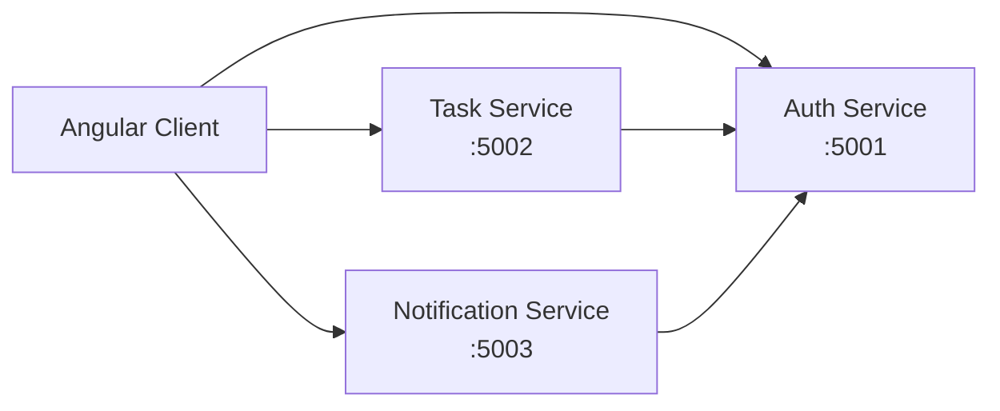

# TaskTracker

A small .NET 8 microservices sample app with Angular clients, using an ASP.NET Core OWIN-compatible middleware pipeline for custom JWT authentication.

## Architecture



This project uses a dedicated auth service that issues signed JWTs and a standard ASP.NET Core authentication pipeline for validating bearer tokens on the protected API services.

## Stack

- ASP.NET Core 8 Minimal APIs
- ASP.NET Core JWT Bearer authentication middleware
- Angular 18 frontend apps
- In-memory task/notification stores
- Refresh-token flow for session renewal

## Authentication flow

1. Angular calls `POST /api/v1/auth/login` on the auth service.
2. The auth service validates username/password and returns `accessToken`, `refreshToken`, and metadata.
3. The app stores the session locally and adds the bearer token to protected API requests.
4. Task and notification services validate incoming JWTs using ASP.NET Core bearer authentication.
5. Expired tokens are refreshed via `POST /api/v1/auth/refresh`.
6. Logout clears the client session and invalidates the stored refresh token.

## Projects

```text
MyTaskTracker/
├── Backend/
│   ├── Tracker.AuthService/
│   │   ├── Program.cs
│   │   ├── appsettings.json
│   │   └── Tracker.AuthService.csproj
│   ├── Tracker.TaskService/
│   │   ├── Program.cs
│   │   ├── appsettings*.json
│   │   └── ...
│   └── Tracker.NotificationService/
│       ├── Program.cs
│       ├── appsettings*.json
│       └── ...
├── Frontend/
│   ├── CustomerApp/
│   └── AdminPortal/
├── README.md
└── .gitignore
```

## Local development

Run each service in a separate terminal:

```bash
cd Backend/Tracker.AuthService && dotnet run
cd Backend/Tracker.TaskService && dotnet run
cd Backend/Tracker.NotificationService && dotnet run
```

Then start the frontends:

```bash
cd Frontend/CustomerApp && npm install && npm start
cd Frontend/AdminPortal && npm install && npm start
```

Local endpoints:

- Auth: `http://localhost:5001`
- Task: `http://localhost:5002`
- Notification: `http://localhost:5003`
- Customer app: `http://localhost:4200`
- Admin portal: `http://localhost:4300`

## Important note

This repo uses the native ASP.NET Core authentication middleware for .NET 8 rather than the classic legacy Katana/OWIN libraries. The architecture is OWIN-compatible at the ASP.NET Core pipeline level, but the implementation follows the current .NET 8 supported approach.

## Known limitations

- Data is in-memory only
- No database persistence yet
- Refresh tokens are session-scoped in memory
- No gateway layer yet
