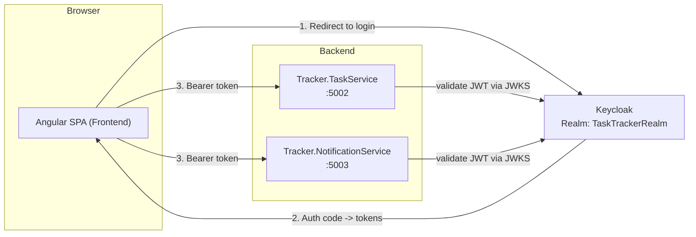

# TaskTracker

A small task-management app built as a microservices practice project: two
.NET 8 backend services and one Angular 18 frontend, all secured through a
single centralized login (OAuth 2.0 / OIDC via Keycloak).

## Architecture



There is no custom AuthService anymore. Keycloak is the single source of
identity; the frontend authenticates against it directly, and each backend
service independently validates the resulting JWT against the same Keycloak
realm (no shared secret between services).

## Folder structure

```
MyTaskTracker/
├── Backend/
│   ├── Tracker.TaskService/            Manages the task list
│   │   ├── Program.cs                  Minimal API: JWT auth, CORS, /api/v1/tasks
│   │   ├── appsettings.json            Base config
│   │   ├── appsettings.Testing.json
│   │   ├── appsettings.Staging.json
│   │   └── appsettings.Production.json
│   └── Tracker.NotificationService/    Serves in-app notifications
│       ├── Program.cs                  Same JWT/CORS pattern, /api/v1/notifications
│       └── appsettings*.json
└── Frontend/                           Angular 18 standalone SPA
    └── src/
        ├── app/
        │   ├── app.config.ts           Bootstraps OAuth via APP_INITIALIZER
        │   ├── app.routes.ts           /login, /tasks (guarded)
        │   ├── auth.guard.ts           Blocks /tasks until a valid token exists
        │   ├── auth.interceptor.ts     Attaches Bearer token to outgoing requests
        │   ├── components/
        │   │   ├── login/              SSO entry screen
        │   │   └── task-board/         Task list + progress bar
        │   └── services/
        │       ├── auth.service.ts         Wraps angular-oauth2-oidc
        │       ├── task.service.ts         Calls TaskService API
        │       └── notification.service.ts Calls NotificationService API
        └── environments/               Per-environment API URLs & OAuth config
```

## Tech stack

- **Backend**: ASP.NET Core 8 Minimal APIs, JWT Bearer auth (validated against
  a Keycloak `Authority` via OIDC discovery), Swashbuckle/Swagger (enabled
  outside Production only).
- **Frontend**: Angular 18 standalone components, `angular-oauth2-oidc`
  (Authorization Code + PKCE flow).
- **Identity Provider**: Keycloak — external, **not included in this repo**.
  You need a running instance with a realm named `TaskTrackerRealm` and a
  public client named `angular-frontend-client`.
- **Hosting target**: IIS, one site per app per environment (Testing,
  Staging, Production).

## Authentication flow (Authorization Code + PKCE)

1. On app start, `AuthService` configures `angular-oauth2-oidc` and calls
   `loadDiscoveryDocumentAndTryLogin()` from an `APP_INITIALIZER`, so this
   always completes before the router picks a route.
2. `authGuard` redirects any unauthenticated visit to `/tasks` back to
   `/login`.
3. Clicking **Continue with SSO** calls `oauthService.initCodeFlow()`, which
   redirects the full browser to Keycloak (with a PKCE `code_challenge`).
4. Keycloak authenticates the user and redirects back to `redirectUri`
   (`/tasks`) with `?code=...&state=...`.
5. The library exchanges the code (+ PKCE `code_verifier`) for tokens, stores
   them in `localStorage`, then the app strips `?code&state` from the URL so
   a page refresh can't resubmit the already-used code.
6. `authInterceptor` attaches `Authorization: Bearer <access_token>` to every
   outgoing HTTP request.
7. `TaskService` and `NotificationService` each validate the token
   independently against Keycloak's JWKS — no shared secret between them.
8. Logout calls `oauthService.logOut()`, clearing local tokens and
   redirecting to Keycloak's end-session endpoint.

## Request flow — loading the task board

1. `/tasks` activates → `authGuard` confirms a valid token.
2. `TaskBoardComponent.ngOnInit()` calls `TaskService.getTasks()` → `GET
   {taskApi}/api/v1/tasks` with the Bearer token attached.
3. `TaskService` (backend) validates the token and returns the task list
   (currently in-memory mock data).
4. The component renders the list and a completion progress bar.

`NotificationService` (frontend) exists and can call
`GET {notificationApi}/api/v1/notifications`, but is **not yet wired into any
component** — it's ready to use once a notifications UI is built.

## Environments

Three deploy targets — Testing, Staging, Production — each with its own
config:

| Concern | Backend | Frontend |
|---|---|---|
| Per-environment values | `appsettings.{Environment}.json` (`Urls`, `FrontendUrl`, `JwtSettings:Authority/Audience/RequireHttpsMetadata`) | `environment.{name}.ts` (`taskApi`, `notificationApi`, `oauth.*`) |
| Selected by | `ASPNETCORE_ENVIRONMENT` env var | `ng build/serve --configuration={name}` |

## Running locally

You need a Keycloak instance running (default expected at
`http://localhost:8080`, realm `TaskTrackerRealm`, client
`angular-frontend-client`) — not included in this repo.

**Backend** (in two terminals):
```bash
cd Backend/Tracker.TaskService && dotnet run
cd Backend/Tracker.NotificationService && dotnet run
```

**Frontend**:
```bash
cd Frontend
npm install
npm start              # local dev, http://localhost:4200
npm run start:testing  # against the Testing config
npm run start:staging  # against the Staging config
```

## Known limitations / next steps

- Task and notification data are in-memory mocks — nothing persists across a
  service restart yet (no database wired in).
- The frontend calls each backend service directly; no API Gateway yet. Worth
  adding before more services join, to centralize CORS/auth/routing.
- No notifications UI — the service is ready but unused.
