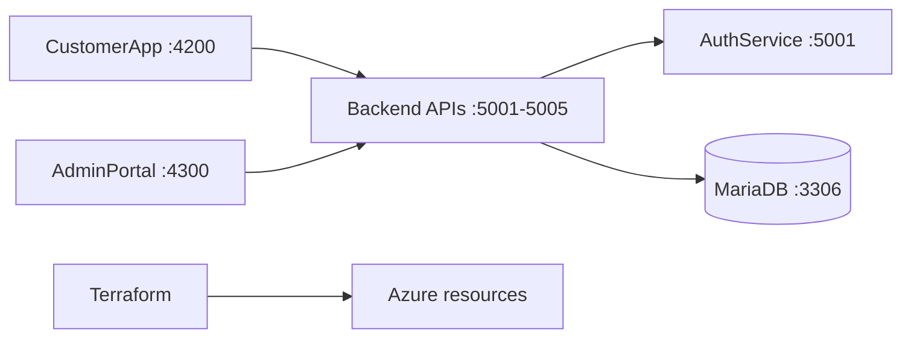

# MyTaskTracker

MyTaskTracker is a task-tracking platform built from five ASP.NET Core 8 microservices, two Angular 18 applications, MariaDB, Docker Compose, and Terraform for Azure infrastructure.

## Repository map

| Area | Purpose | Documentation |
| --- | --- | --- |
| `app/` | Application source, local orchestration, and deployment docs | [app/README.md](app/README.md) |
| `infrastructure/` | Terraform environments and reusable Azure modules | [Infrastructure README](infrastructure/README.md) |

Implementation details are documented within [app/README.md](app/README.md) and [infrastructure/README.md](infrastructure/README.md). Generated directories such as `bin/`, `obj/`, `node_modules/`, and Terraform `.terraform/` are not documentation targets.

## Architecture



The APIs use opaque bearer tokens. AuthService validates credentials and token sessions; protected services call AuthService's `/verify` endpoint. Each service owns a separate MariaDB database.

## Quick start

Prerequisites: .NET 8 SDK, Node.js/npm, Docker Desktop, Docker Compose, and Terraform when working with Azure infrastructure.

```powershell
Copy-Item app\.env.example app\.env
Push-Location app
docker compose up -d mariadb
Pop-Location
```

For the complete local workflow, including secrets, migrations, backend commands, and frontend commands, see [app/README.md](app/README.md).

For a full Docker Compose run:

```powershell
Push-Location app
docker compose up --build
Pop-Location
```

The local applications are available at `http://localhost:4200` and `http://localhost:4300`.

## Verification

```powershell
dotnet build app/Backend/Tracker.AuthService/Tracker.AuthService.csproj
Push-Location app/Frontend/CustomerApp; npm.cmd run build; Pop-Location
Push-Location app/Frontend/AdminPortal; npm.cmd run build; Pop-Location
```

Terraform validation is documented in [infrastructure/README.md](infrastructure/README.md). Do not commit `.env`, user secrets, deployment credentials, or a real `backend.hcl`.

## Contribution

Use focused Conventional Commit messages such as `feat(task): add task filtering` or `docs(infra): update deployment guide`. See [app/CONTRIBUTING.md](app/CONTRIBUTING.md) for repository-specific contribution rules.
