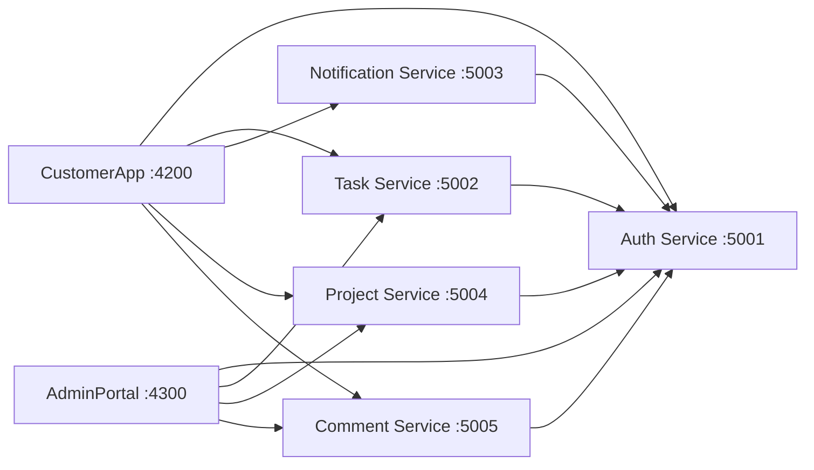

# TaskTracker

TaskTracker is a .NET 8 microservices sample with two Angular 18 applications and five backend services:

- **CustomerApp** (`http://localhost:4200`) for tasks, projects, comments, and notifications.
- **AdminPortal** (`http://localhost:4300`) for task summaries, user access, projects, and comments.

Authentication preserves an OWIN-style password-grant contract while using ASP.NET Core middleware. The system uses opaque bearer tokens: they are random strings stored in memory and validated server-side on every protected request. No JWT is used for the runtime auth flow.

## Architecture



All protected resource services validate bearer tokens against AuthService. NotificationService, TaskService, ProjectService, and CommentService therefore use the same opaque-token authentication model; none of them accepts JWTs.

## Projects

| Project | Responsibility | Local URL |
| --- | --- | --- |
| `Backend/Tracker.AuthService` | Login, refresh, logout, and token verification | `http://localhost:5001` |
| `Backend/Tracker.TaskService` | User tasks and admin task/user endpoints | `http://localhost:5002` |
| `Backend/Tracker.NotificationService` | User notifications | `http://localhost:5003` |
| `Backend/Tracker.ProjectService` | Lightweight project grouping for tasks | `http://localhost:5004` |
| `Backend/Tracker.CommentService` | Task comment threads | `http://localhost:5005` |
| `Frontend/CustomerApp` | Customer-facing Angular application | `http://localhost:4200` |
| `Frontend/AdminPortal` | Admin Angular application | `http://localhost:4300` |

## Authentication flow

1. An Angular app sends form-encoded credentials to `POST /token` on AuthService.
2. AuthService returns a camelCase response containing `accessToken`, `refreshToken`, `expiresIn`, `username`, and `roles`.
3. The app stores its session locally and adds `Authorization: Bearer <token>` to API requests.
4. TaskService, NotificationService, ProjectService, and CommentService call AuthService's `GET /verify` endpoint to validate the opaque token and create user claims.
5. `POST /api/v1/auth/refresh` renews the access token; `POST /api/v1/auth/logout` invalidates the refresh session.

Example local sign-in request:

```text
POST http://localhost:5001/token
Content-Type: application/x-www-form-urlencoded

grant_type=password&username=admin&password=123456
```

## Run locally

Prerequisites: .NET 8 SDK, Node.js, and npm.

Start each backend service in a separate terminal:

```powershell
dotnet run --project Backend/Tracker.AuthService
dotnet run --project Backend/Tracker.TaskService
dotnet run --project Backend/Tracker.NotificationService
dotnet run --project Backend/Tracker.ProjectService
dotnet run --project Backend/Tracker.CommentService
```

Start each frontend in a separate terminal:

```powershell
Push-Location Frontend/CustomerApp; npm.cmd install; npm.cmd start
Push-Location Frontend/AdminPortal; npm.cmd install; npm.cmd start
```

Use `npm.cmd` in PowerShell if local execution policy blocks `npm.ps1`.

## Build

```powershell
dotnet build Backend/Tracker.AuthService/Tracker.AuthService.csproj
dotnet build Backend/Tracker.TaskService/Tracker.TaskService.csproj
dotnet build Backend/Tracker.NotificationService/Tracker.NotificationService.csproj
dotnet build Backend/Tracker.ProjectService/Tracker.ProjectService.csproj
dotnet build Backend/Tracker.CommentService/Tracker.CommentService.csproj

Push-Location Frontend/CustomerApp; npm.cmd run build:production; Pop-Location
Push-Location Frontend/AdminPortal; npm.cmd run build:production; Pop-Location
```

The production Angular builds use their respective `environment.prod.ts` files and do not require build-time Google Fonts access.

## IIS deployment

See [DEPLOYMENT.md](DEPLOYMENT.md) for prerequisites, production configuration, publish commands, IIS application-pool settings, frontend deployment paths, and post-deployment verification.

Before any production build, replace the `*.yourdomain.com` placeholders in both frontend `environment.prod.ts` files with the final HTTPS API origins. They are compiled into the bundles.

## Important limitations

This repository is a demonstration, not production-ready identity or data infrastructure:

- AuthService currently contains the demo account `admin` / `123456`.
- Tokens, refresh sessions, tasks, notifications, users, and roles are in memory only.
- Restarting a service or recycling an IIS application pool invalidates sessions and loses data.
- Replace the demo credential lookup and in-memory stores with persistent, securely managed implementations before exposing the application publicly.

## Current local UI notes

- CustomerApp now shows a project hub alongside task work, and its comment area lets you pick a task from the visible project list instead of forcing manual GUID entry.
- AdminPortal includes project and comment inspection panels in the main dashboard.
- If you restart AuthService or any protected backend, sign out and sign in again. The apps now validate the stored token on startup, but a fresh login is still the fastest recovery path because the services keep auth state in memory.
