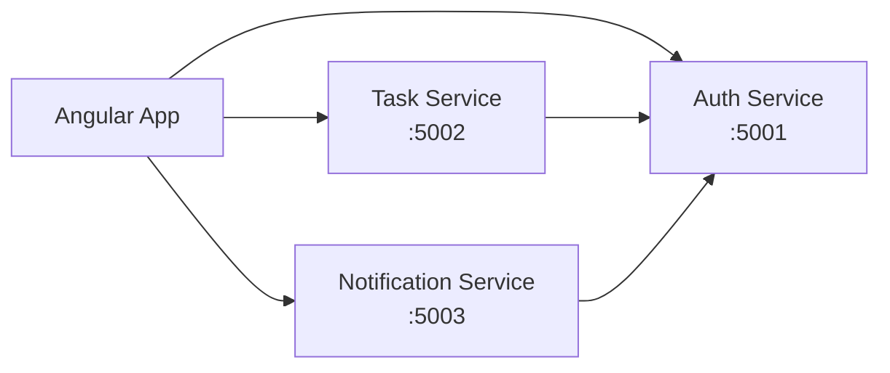

# TaskTracker

A small .NET 8 microservices sample app with Angular clients, using an OWIN-style custom token flow implemented with ASP.NET Core middleware and opaque tokens.

## Overview

This project was migrated from the legacy OWIN / OAuth server model to a modern .NET 8 implementation while keeping the same high-level contract:

- a dedicated auth service issues a token via `/token`
- resource services validate bearer tokens through `/verify`
- frontend apps use the auth service as the identity source

The important difference is that this is not the old `Microsoft.Owin.*` stack. It uses native ASP.NET Core middleware and a custom authentication handler.

## Architecture



## Stack

- ASP.NET Core 8 Minimal APIs
- Custom OWIN-style password grant flow
- Opaque access tokens instead of JWT
- Custom bearer auth validation in resource services
- Angular 18 frontend apps
- In-memory stores for tasks, notifications, and refresh sessions

## Authentication flow

1. Frontend submits form-encoded credentials to `POST /token` on Auth Service.
2. Auth Service validates `grant_type=password`, `username`, and `password`.
3. If valid, it returns an opaque `access_token` and a `refresh_token`.
4. Frontend stores the session locally and sends `Authorization: Bearer <token>` to protected API calls.
5. Task/Notification Service validates the token via `GET /verify?token=...`.
6. `POST /api/v1/auth/refresh` renews the session and `POST /api/v1/auth/logout` clears it.

## Auth service endpoints

```text
POST /token
  Content-Type: application/x-www-form-urlencoded
  grant_type=password&username=admin&password=123456

GET /verify?token=<opaque-token>

POST /api/v1/auth/login
POST /api/v1/auth/refresh
POST /api/v1/auth/logout
```

## Project structure

```text
MyTaskTracker/
├── Backend/
│   ├── Tracker.AuthService/
│   │   ├── Program.cs
│   │   ├── appsettings.json
│   │   └── Tracker.AuthService.csproj
│   ├── Tracker.TaskService/
│   │   ├── Program.cs
│   │   ├── appsettings*.json
│   │   └── ...
│   └── Tracker.NotificationService/
│       ├── Program.cs
│       ├── appsettings*.json
│       └── ...
├── Frontend/
│   ├── CustomerApp/
│   └── AdminPortal/
├── README.md
└── .gitignore
```

## Local development

Run services in separate terminals:

```bash
cd Backend/Tracker.AuthService && dotnet run
cd Backend/Tracker.TaskService && dotnet run
cd Backend/Tracker.NotificationService && dotnet run
```

Run frontends:

```bash
cd Frontend/CustomerApp && npm install && npm start
cd Frontend/AdminPortal && npm install && npm start
```

## Local endpoints

- Auth: `http://localhost:5001`
- Task: `http://localhost:5002`
- Notification: `http://localhost:5003`
- Customer app: `http://localhost:4200`
- Admin portal: `http://localhost:4300`

## Important note

This repo intentionally preserves the classic OWIN-style token contract for compatibility and migration clarity, but it implements it in .NET 8 using ASP.NET Core middleware and a custom authentication handler instead of legacy `Microsoft.Owin.*` libraries.

## Current limitations

- Data is in-memory only
- No database persistence yet
- Refresh tokens are session-scoped only
- No API gateway or external identity provider yet

## Summary

The project is now a working .NET 8 OWIN-style microservice auth flow with:

- `/token` password grant support
- opaque token issuance
- backend token verification through `/verify`
- frontend login integration
- backend validation with custom bearer auth

This is the correct model if the goal is to preserve the old OWIN contract while running on the modern ASP.NET Core platform.
