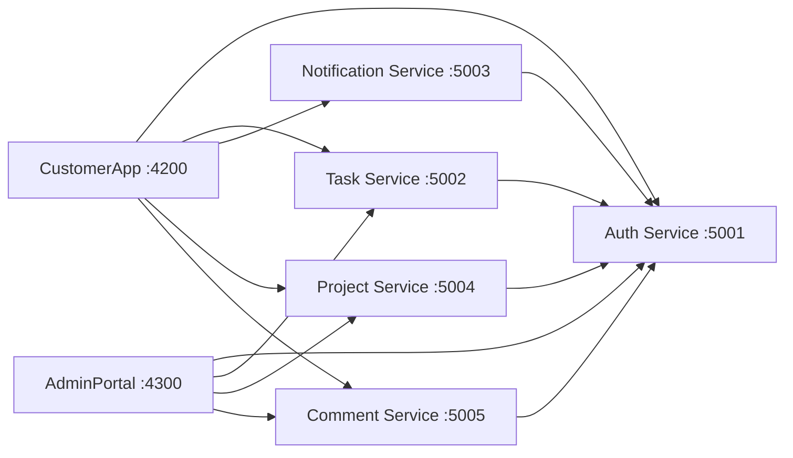
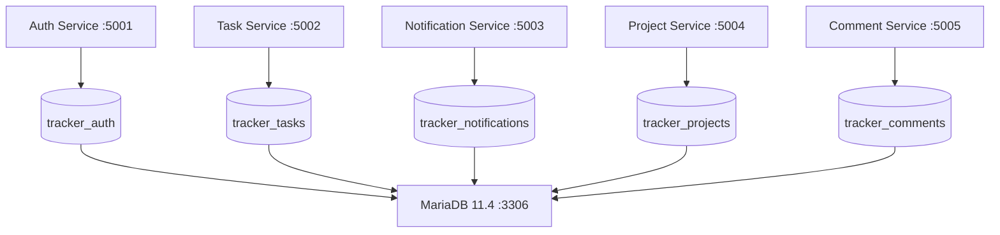
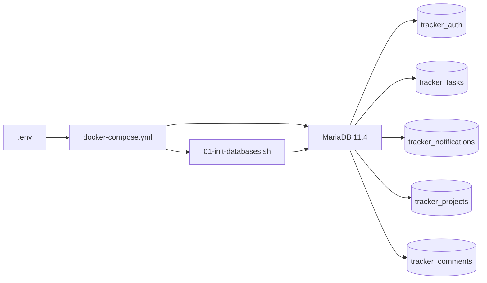

# TaskTracker

TaskTracker is a .NET 8 microservices sample with two Angular 18 applications and five backend services:

- **CustomerApp** (`http://localhost:4200`) for tasks, projects, comments, and notifications.
- **AdminPortal** (`http://localhost:4300`) for task summaries, user access, projects, and comments.

Authentication preserves an OWIN-style password-grant contract while using ASP.NET Core middleware. The system uses opaque bearer tokens: they are random strings validated server-side on every protected request. No JWT is used for the runtime auth flow.

## Architecture



All protected resource services validate bearer tokens against AuthService. NotificationService, TaskService, ProjectService, and CommentService therefore use the same opaque-token authentication model; none of them accepts JWTs.

## Projects

| Project | Responsibility | Local URL |
| --- | --- | --- |
| `Backend/Tracker.AuthService` | Login, refresh, logout, register, and token verification | `http://localhost:5001` |
| `Backend/Tracker.TaskService` | User tasks and admin task/user endpoints | `http://localhost:5002` |
| `Backend/Tracker.NotificationService` | User notifications | `http://localhost:5003` |
| `Backend/Tracker.ProjectService` | Lightweight project grouping for tasks | `http://localhost:5004` |
| `Backend/Tracker.CommentService` | Task comment threads | `http://localhost:5005` |
| `Frontend/CustomerApp` | Customer-facing Angular application | `http://localhost:4200` |
| `Frontend/AdminPortal` | Admin Angular application | `http://localhost:4300` |

## Authentication flow

1. An Angular app sends form-encoded credentials to `POST /token` on AuthService (or JSON to `POST /api/v1/auth/login` / `POST /api/v1/auth/register`).
2. AuthService returns a camelCase response containing `accessToken`, `refreshToken`, `expiresIn`, `username`, and `roles`.
3. The app stores its session locally and adds `Authorization: Bearer <token>` to API requests.
4. TaskService, NotificationService, ProjectService, and CommentService call AuthService's `GET /verify` endpoint to validate the opaque token and create user claims.
5. `POST /api/v1/auth/refresh` renews the access token; `POST /api/v1/auth/logout` invalidates the refresh session.

Example local sign-in request:

```text
POST http://localhost:5001/token

Content-Type: application/x-www-form-urlencoded

grant_type=password&username=admin&password=123456
```

## Database

TaskTracker uses **MariaDB 11.4** as the persistent database system.

The application follows a **database-per-service** approach.

Each backend microservice owns and accesses its own database. The databases are hosted by the same MariaDB instance during local development, but the services do **not** share application tables or database credentials.

### Database architecture



### Database ownership

| Microservice | Database | Database User | Responsibility |
| --- | --- | --- | --- |
| `Tracker.AuthService` | `tracker_auth` | `auth_service` | Users and authentication-related persistent data |
| `Tracker.TaskService` | `tracker_tasks` | `task_service` | Tasks and task-related data |
| `Tracker.NotificationService` | `tracker_notifications` | `notification_service` | User notifications |
| `Tracker.ProjectService` | `tracker_projects` | `project_service` | Projects and project-related data |
| `Tracker.CommentService` | `tracker_comments` | `comment_service` | Comments and comment threads |

Each service accesses **only its own database**.

For example:

```text
AuthService
    |
    v
tracker_auth

TaskService
    |
    v
tracker_tasks

ProjectService
    |
    v
tracker_projects
```

Services communicate with each other through APIs rather than directly sharing database tables.

### MariaDB Docker configuration

The local environment uses:

```text
MariaDB 11.4
Host: localhost
Port: 3306
Container: tracker-mariadb
```

MariaDB is started using Docker Compose:

```powershell
docker-compose up -d mariadb
```

The database is persisted using the Docker volume:

```yaml
volumes:
  - mariadb_data:/var/lib/mysql
```

Therefore, restarting or recreating the MariaDB container normally does not remove existing database data.

### Database initialization

The database initialization script is located at:

```text
infra/
└── mariadb/
    └── init/
        └── 01-init-databases.sh
```

Docker Compose mounts this directory into the MariaDB container:

```yaml
volumes:
  - ./infra/mariadb/init:/docker-entrypoint-initdb.d:ro
```

The MariaDB Docker entrypoint automatically executes initialization scripts inside `/docker-entrypoint-initdb.d` when the database is initialized with an empty data directory.

The initialization script creates the five service databases:

```text
tracker_auth
tracker_tasks
tracker_notifications
tracker_projects
tracker_comments
```

It also creates the corresponding service database users:

```text
auth_service
task_service
notification_service
project_service
comment_service
```

Each user receives access only to its corresponding database.

### Database initialization flow



### Database environment variables

The database passwords are supplied through `.env`:

```env
MARIADB_ROOT_PASSWORD=...

AUTH_DB_PASSWORD=...
TASK_DB_PASSWORD=...
NOTIFICATION_DB_PASSWORD=...
PROJECT_DB_PASSWORD=...
COMMENT_DB_PASSWORD=...
```

Do **not** commit the real `.env` file to Git.

Use `.env.example` to document the required environment variables without exposing real credentials.

### EF Core migrations

The initialization script is responsible for creating:

- Databases
- Database users
- Database permissions

It is **not** responsible for creating the application tables.

Each microservice owns its own Entity Framework Core migrations:

```text
Backend/
├── Tracker.AuthService/
│   └── Data/
│       └── Migrations/
│
├── Tracker.TaskService/
│   └── Data/
│       └── Migrations/
│
├── Tracker.NotificationService/
│   └── Data/
│       └── Migrations/
│
├── Tracker.ProjectService/
│   └── Data/
│       └── Migrations/
│
└── Tracker.CommentService/
    └── Data/
        └── Migrations/
```

The database setup therefore has two stages:

```text
01-init-databases.sh
        |
        +-- Create database
        +-- Create service user
        +-- Grant database permissions
        |
        v
MariaDB databases
        |
        v
EF Core migrations
        |
        +-- Create application tables
        +-- Update database schema
        +-- Apply schema changes
```

This keeps database ownership aligned with microservice ownership.

### Database persistence

Application data is persisted in MariaDB rather than in-memory stores.

Restarting an individual backend service does not remove its database records because the data is stored in MariaDB.

The MariaDB data is persisted through:

```text
mariadb_data
    |
    v
/var/lib/mysql
```

To completely reset the local database environment:

```powershell
docker-compose down -v
docker-compose up -d mariadb
```

> **Warning:** `docker-compose down -v` removes the `mariadb_data` volume and permanently deletes all local MariaDB data.

### Database initialization vs. migrations

| Mechanism | Responsibility |
| --- | --- |
| `01-init-databases.sh` | Creates databases, service users, and database permissions |
| EF Core migrations | Creates and updates application tables and schemas |
| `mariadb_data` | Persists MariaDB data between container restarts |

The initialization script normally runs only when MariaDB starts with an empty data directory.

Changing `01-init-databases.sh` does not automatically execute it again if the `mariadb_data` volume already contains an initialized database.

To completely reinitialize the local database:

```powershell
docker-compose down -v
docker-compose up -d mariadb
```

Only perform this reset when existing local database data can be discarded.

## Run locally

### Prerequisites

Install:

- .NET 8 SDK
- Node.js
- npm
- Docker
- Docker Compose

### 1. Configure environment variables

Create a `.env` file in the repository root:

```text
MyTaskTracker/
├── .env
├── docker-compose.yml
├── Backend/
├── Frontend/
└── infra/
```

Example for local development:

```env
MARIADB_ROOT_PASSWORD=123

AUTH_DB_PASSWORD=123
TASK_DB_PASSWORD=123
NOTIFICATION_DB_PASSWORD=123
PROJECT_DB_PASSWORD=123
COMMENT_DB_PASSWORD=123
```

Use secure passwords for environments other than local development.

### 2. Start MariaDB

From the repository root:

```powershell
docker-compose up -d mariadb
```

Check the container:

```powershell
docker ps
```

Expected container:

```text
tracker-mariadb
```

Check the MariaDB health status:

```powershell
docker inspect --format='{{.State.Health.Status}}' tracker-mariadb
```

Expected:

```text
healthy
```

View MariaDB logs:

```powershell
docker-compose logs mariadb
```

During the first initialization, the logs should contain:

```text
running /docker-entrypoint-initdb.d/01-init-databases.sh
```

and:

```text
Tracker databases initialized successfully.
```

### 3. Verify the databases

Connect to MariaDB:

```powershell
docker exec -it tracker-mariadb mariadb -uroot -p
```

Then run:

```sql
SHOW DATABASES;
```

Expected databases:

```text
tracker_auth
tracker_tasks
tracker_notifications
tracker_projects
tracker_comments
```

You can also verify the service users:

```sql
SELECT User, Host
FROM mysql.user
WHERE User IN (
    'auth_service',
    'task_service',
    'notification_service',
    'project_service',
    'comment_service'
);
```

### 4. Apply EF Core migrations

If migrations are not automatically applied by the application at startup, apply them manually:

```powershell
dotnet ef database update --project Backend/Tracker.AuthService
dotnet ef database update --project Backend/Tracker.TaskService
dotnet ef database update --project Backend/Tracker.NotificationService
dotnet ef database update --project Backend/Tracker.ProjectService
dotnet ef database update --project Backend/Tracker.CommentService
```

After the migrations are applied, each database should contain the tables required by its corresponding service.

### 5. Start backend services

Start each backend service in a separate terminal.

#### Auth Service

```powershell
dotnet run --project Backend/Tracker.AuthService
```

Runs on:

```text
http://localhost:5001
```

#### Task Service

```powershell
dotnet run --project Backend/Tracker.TaskService
```

Runs on:

```text
http://localhost:5002
```

#### Notification Service

```powershell
dotnet run --project Backend/Tracker.NotificationService
```

Runs on:

```text
http://localhost:5003
```

#### Project Service

```powershell
dotnet run --project Backend/Tracker.ProjectService
```

Runs on:

```text
http://localhost:5004
```

#### Comment Service

```powershell
dotnet run --project Backend/Tracker.CommentService
```

Runs on:

```text
http://localhost:5005
```

### 6. Start CustomerApp

Open another terminal:

```powershell
cd Frontend/CustomerApp
npm.cmd install
npm.cmd start
```

Application:

```text
http://localhost:4200
```

### 7. Start AdminPortal

Open another terminal:

```powershell
cd Frontend/AdminPortal
npm.cmd install
npm.cmd start
```

Application:

```text
http://localhost:4300
```

Use `npm.cmd` in PowerShell if the local execution policy blocks `npm.ps1`.

### Recommended local development setup

At the current development stage, only MariaDB runs inside Docker. The backend and frontend applications run directly on the host.

```text
                         Docker
                           |
                           v
                  +------------------+
                  |   MariaDB 11.4   |
                  |     :3306        |
                  +--------+---------+
                           |
             +-------------+-------------+
             |             |             |
             v             v             v
       tracker_auth  tracker_tasks  tracker_notifications
             |             |             |
             v             v             v
        AuthService   TaskService   NotificationService
             |             |
             v             v
       tracker_projects  tracker_comments
             |             |
             v             v
       ProjectService  CommentService

CustomerApp :4200
AdminPortal  :4300
       |
       v
  Backend APIs
```

This setup allows the services to be debugged locally while keeping the database environment consistent with the future Docker deployment.

## Docker Compose commands

### Start only MariaDB

```powershell
docker-compose up -d mariadb
```

This is the recommended command while backend services are still running with `dotnet run`.

### Stop MariaDB

```powershell
docker-compose stop mariadb
```

### Start MariaDB again

```powershell
docker-compose start mariadb
```

### View MariaDB logs

```powershell
docker-compose logs -f mariadb
```

### Check running containers

```powershell
docker ps
```

### Stop and remove containers

```powershell
docker-compose down
```

This does **not** remove the `mariadb_data` volume.

### Completely reset the local database

```powershell
docker-compose down -v
docker-compose up -d mariadb
```

> **Warning:** This deletes the `mariadb_data` volume and all local MariaDB data.

## Quick start

From the repository root:

```powershell
# 1. Start MariaDB
docker-compose up -d mariadb

# 2. Verify the database container
docker ps

# 3. Start AuthService
dotnet run --project Backend/Tracker.AuthService

# 4. Start TaskService
dotnet run --project Backend/Tracker.TaskService

# 5. Start NotificationService
dotnet run --project Backend/Tracker.NotificationService

# 6. Start ProjectService
dotnet run --project Backend/Tracker.ProjectService

# 7. Start CommentService
dotnet run --project Backend/Tracker.CommentService

# 8. Start CustomerApp
cd Frontend/CustomerApp
npm.cmd start

# 9. Start AdminPortal in another terminal
cd Frontend/AdminPortal
npm.cmd start
```

## Build

```powershell
dotnet build Backend/Tracker.AuthService/Tracker.AuthService.csproj

dotnet build Backend/Tracker.TaskService/Tracker.TaskService.csproj

dotnet build Backend/Tracker.NotificationService/Tracker.NotificationService.csproj

dotnet build Backend/Tracker.ProjectService/Tracker.ProjectService.csproj

dotnet build Backend/Tracker.CommentService/Tracker.CommentService.csproj

Push-Location Frontend/CustomerApp
npm.cmd run build:production
Pop-Location

Push-Location Frontend/AdminPortal
npm.cmd run build:production
Pop-Location
```

The production Angular builds use their respective `environment.prod.ts` files and do not require build-time Google Fonts access.

## IIS deployment

See [DEPLOYMENT.md](DEPLOYMENT.md) for prerequisites, production configuration, publish commands, IIS application-pool settings, frontend deployment paths, and post-deployment verification.

Before any production build, replace the `*.yourdomain.com` placeholders in both frontend `environment.prod.ts` files with the final HTTPS API origins. They are compiled into the bundles.

## Important limitations

This repository is a demonstration, not production-ready identity or data infrastructure:

- AuthService seeds a demo account (`admin` / `123456`) the first time it runs against an empty database.

- Users, tasks, notifications, projects, and comments are persisted in MariaDB. Each service uses its own database according to the database-per-service architecture.

- Access tokens and refresh sessions are still held in an in-process `ConcurrentDictionary` inside AuthService, not in MariaDB. Restarting AuthService, or running more than one AuthService instance behind a load balancer, invalidates every active session. Keep AuthService to a single instance until token storage moves to a shared store such as a MariaDB table or Redis.

- Recycling any other service no longer loses persisted data because application data is stored in MariaDB. In-flight requests may still return `401` until the client's token is re-verified.

- Replace the demo credential lookup with your own account-provisioning process before exposing the application publicly.

- The current local Docker setup runs MariaDB in a container, while the backend and frontend applications run directly on the host. Full application containerization is a separate deployment step.

## Current local UI notes

- CustomerApp now shows a project hub alongside task work, and its comment area lets you pick a task from the visible project list instead of forcing manual GUID entry.

- CustomerApp has a `/register` page (`POST /api/v1/auth/register`) alongside `/login`.

- AdminPortal includes project and comment inspection panels in the main dashboard.

- If you restart AuthService or any protected backend, sign out and sign in again. The apps now validate the stored token on startup, but a fresh login is still the fastest recovery path because AuthService keeps token/refresh-session state in memory.
