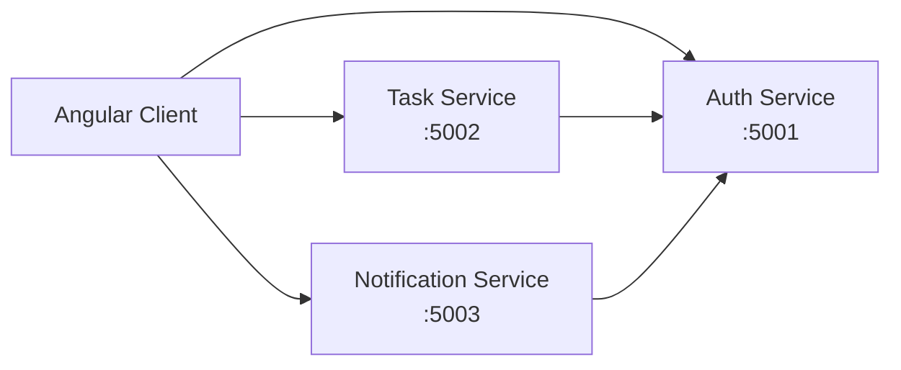

# TaskTracker

A small .NET 8 microservices sample app with Angular clients, using an OWIN-style custom token flow implemented with ASP.NET Core middleware and opaque tokens.

## Architecture



This project keeps the classic OWIN-style contract of a dedicated auth service that issues a token over `/token` and lets resource services verify it through `/verify`, but it is implemented on .NET 8 using native ASP.NET Core middleware instead of the legacy `Microsoft.Owin.*` stack.

## Stack

- ASP.NET Core 8 Minimal APIs
- Custom opaque-token auth flow
- ASP.NET Core authentication handler for bearer validation
- Angular 18 frontend apps
- In-memory task/notification stores
- Session and refresh token handling in memory

## Authentication flow

1. Angular sends `application/x-www-form-urlencoded` credentials to `POST /token` on the auth service.
2. The auth service validates `grant_type=password`, `username`, and `password` and returns an opaque `access_token` plus a refresh token for app session compatibility.
3. The frontend stores the session locally and adds `Authorization: Bearer <token>` to protected requests.
4. Task and notification services validate the token by calling the auth service `GET /verify?token=...` through a custom ASP.NET Core authentication handler.
5. Refresh requests are issued through `POST /api/v1/auth/refresh` and logout clears the stored token state.

## Auth service endpoints

```text
POST /token
  Content-Type: application/x-www-form-urlencoded
  grant_type=password&username=admin&password=123456

GET /verify?token=<opaque-token>

POST /api/v1/auth/login
POST /api/v1/auth/refresh
POST /api/v1/auth/logout
```

## Projects

```text
MyTaskTracker/
├── Backend/
│   ├── Tracker.AuthService/
│   │   ├── Program.cs
│   │   ├── appsettings.json
│   │   └── Tracker.AuthService.csproj
│   ├── Tracker.TaskService/
│   │   ├── Program.cs
│   │   ├── appsettings*.json
│   │   └── ...
│   └── Tracker.NotificationService/
│       ├── Program.cs
│       ├── appsettings*.json
│       └── ...
├── Frontend/
│   ├── CustomerApp/
│   └── AdminPortal/
├── README.md
└── .gitignore
```

## Local development

Run each service in a separate terminal:

```bash
cd Backend/Tracker.AuthService && dotnet run
cd Backend/Tracker.TaskService && dotnet run
cd Backend/Tracker.NotificationService && dotnet run
```

Then start the frontends:

```bash
cd Frontend/CustomerApp && npm install && npm start
cd Frontend/AdminPortal && npm install && npm start
```

Local endpoints:

- Auth: `http://localhost:5001`
- Task: `http://localhost:5002`
- Notification: `http://localhost:5003`
- Customer app: `http://localhost:4200`
- Admin portal: `http://localhost:4300`

## Important note

This repo intentionally keeps the classic OWIN-style token flow contract for compatibility and migration clarity, but it does so on .NET 8 using ASP.NET Core middleware and custom bearer authentication instead of the legacy `Microsoft.Owin.*` stack.

## Known limitations

- Data is in-memory only
- No database persistence yet
- Refresh tokens are session-scoped in memory
- No gateway layer yet
