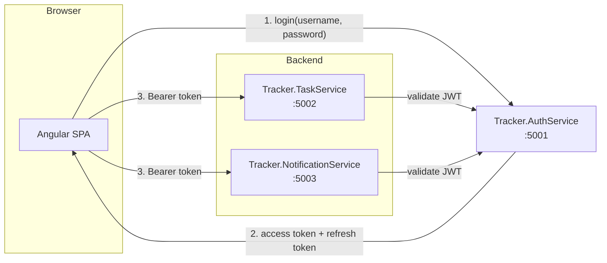

# TaskTracker

A small task-management microservices project built with .NET 8 and Angular.
This repo uses a custom JWT-based authentication flow instead of Keycloak.

## Architecture



The application uses a dedicated `Tracker.AuthService` to issue JWTs. The frontend calls the auth service directly, stores the returned tokens in browser storage, and then sends the access token as a bearer token to the protected backend APIs.

## Folder structure

```text
MyTaskTracker/
├── Backend/
│   ├── Tracker.AuthService/
│   │   ├── Program.cs
│   │   ├── appsettings.json
│   │   └── Tracker.AuthService.csproj
│   ├── Tracker.TaskService/
│   │   ├── Program.cs
│   │   ├── appsettings*.json
│   │   ├── Endpoints/
│   │   ├── Services/
│   │   └── Models/
│   └── Tracker.NotificationService/
│       ├── Program.cs
│       ├── appsettings*.json
│       ├── Endpoints/
│       ├── Services/
│       └── Models/
├── Frontend/
│   ├── CustomerApp/
│   │   ├── src/
│   │   └── package.json
│   └── AdminPortal/
│       ├── src/
│       └── package.json
├── README.md
└── .gitignore
```

## Tech stack

- **Backend**: ASP.NET Core 8 Minimal APIs
- **Authentication**: custom JWT bearer tokens signed by the auth service
- **Frontend**: Angular 18 standalone apps
- **Token flow**: username/password login -> JWT access token + refresh token -> bearer auth on API calls
- **Hosting**: local dev ports and environment-specific config files

## Authentication flow

1. The frontend calls `POST /api/v1/auth/login` to the auth service with a username and password.
2. The auth service validates the credentials and returns:
   - `accessToken`
   - `refreshToken`
   - `expiresAt`
   - `username`
   - `roles`
3. The Angular app stores the session in localStorage and attaches the access token to outgoing requests via the HTTP interceptor.
4. Protected backend APIs validate the JWT using ASP.NET Core JWT bearer authentication.
5. When a token expires, the frontend calls `POST /api/v1/auth/refresh` to obtain a fresh access token.
6. Logout clears the stored session and calls the logout endpoint if a refresh token exists.

## Backend endpoints

### Auth Service

- `POST /token` — OAuth-style token endpoint for token issuance
- `POST /api/v1/auth/login` — app login endpoint
- `POST /api/v1/auth/refresh` — refresh access token
- `POST /api/v1/auth/logout` — revoke refresh token
- `GET /api/v1/auth/me` — protected endpoint example

### Task Service

- `GET /api/v1/tasks`
- `POST /api/v1/tasks`
- `PUT /api/v1/tasks/{id}`
- `DELETE /api/v1/tasks/{id}`
- `GET /api/v1/tasks/admin/...` for admin-only routes

### Notification Service

- `GET /api/v1/notifications`
- `POST /api/v1/notifications`

## Environments

The repo uses per-environment configuration files for local and deployment values:

- `Backend/Tracker.AuthService/appsettings.json`
- `Backend/Tracker.TaskService/appsettings.{Environment}.json`
- `Backend/Tracker.NotificationService/appsettings.{Environment}.json`
- `Frontend/CustomerApp/src/environments/environment*.ts`
- `Frontend/AdminPortal/src/environments/environment*.ts`

## Running locally

Start the services in separate terminals:

```bash
cd Backend/Tracker.AuthService && dotnet run
cd Backend/Tracker.TaskService && dotnet run
cd Backend/Tracker.NotificationService && dotnet run
```

Then start the frontend apps:

```bash
cd Frontend/CustomerApp && npm install && npm start
cd Frontend/AdminPortal && npm install && npm start
```

Default local URLs:

- Auth Service: `http://localhost:5001`
- Task Service: `http://localhost:5002`
- Notification Service: `http://localhost:5003`
- Customer App: `http://localhost:4200`
- Admin Portal: `http://localhost:4300`

## Known limitations / next steps

- The app currently keeps task and notification data in memory.
- There is no database persistence yet.
- Refresh tokens are kept in memory in the auth service for the current app session.
- No API gateway is in place yet.
- No separate UI for user registration or identity management has been added.
