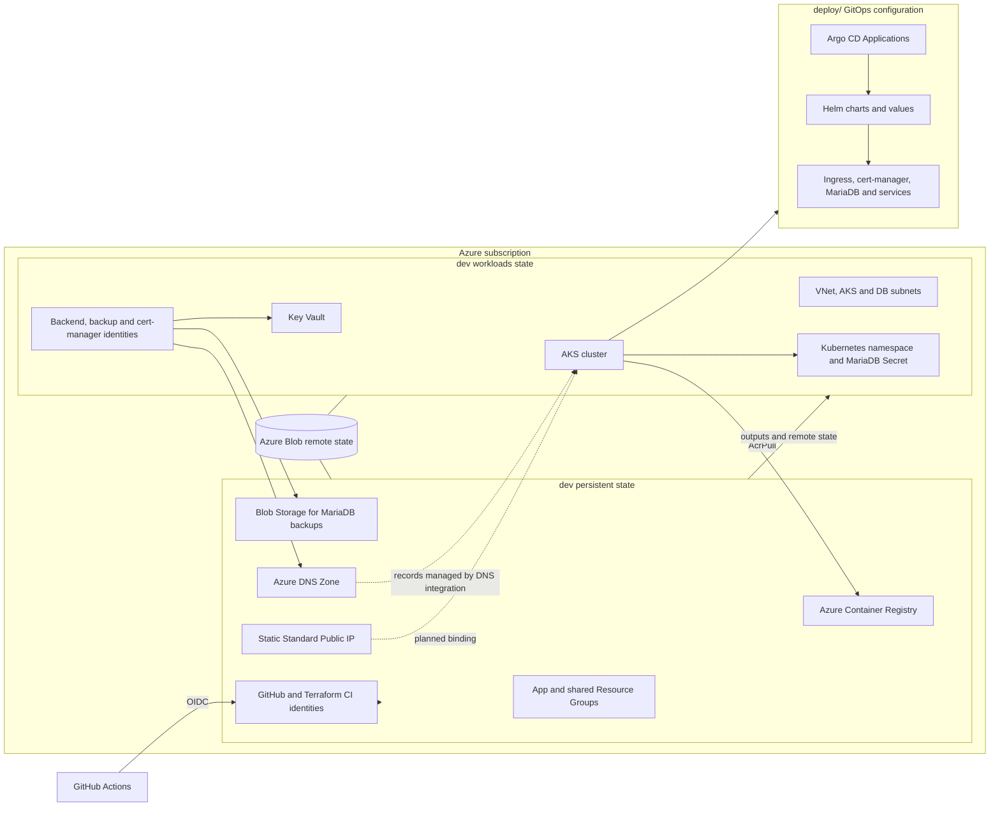

# MyTaskTracker Infrastructure

This directory contains the Azure infrastructure-as-code for MyTaskTracker. Terraform provisions Azure foundations and the AKS platform; Kubernetes application definitions and their GitOps wiring live in the sibling `deploy/` directory.

## Architecture At A Glance

The `dev` environment is split into two Terraform roots with separate Azure Blob state files. The persistent root owns resources that should survive replacement of the AKS workloads. The workloads root reads the persistent outputs through `terraform_remote_state` and creates the cluster and environment-specific resources.



### Azure layers

| Layer | Resources and purpose |
| --- | --- |
| Persistent foundation | Creates the app and shared Resource Groups, ACR, private MariaDB backup container, storage lifecycle policy, GitHub Actions and Terraform CI user-assigned identities, and their scoped role assignments. |
| Public networking foundation | Creates the Azure DNS zone and a static Standard Public IP in the shared Resource Group. The DNS zone name servers are output for registrar delegation. |
| AKS workloads | Creates the VNet, AKS and database subnets, database NSG, AKS cluster, and the AKS-to-ACR `AcrPull` assignment. Current dev address ranges are `10.0.0.0/16`, `10.0.1.0/24` (AKS), and `10.0.2.0/24` (DB subnet). |
| Application platform | Creates a Key Vault, per-backend workload identities and Key Vault access, database passwords and connection-string secrets, Kubernetes namespace/initialization Secret, backup identity/storage permission, and cert-manager identity with DNS Zone Contributor scoped to the project's DNS zone. |
| Kubernetes delivery | `deploy/` contains Argo CD Application definitions, Helm charts, base service values, and dev-specific values for services and platform components. This is the delivery layer, not a Terraform module. |

### Network and identity flow

- AKS uses a system-assigned cluster identity and a separate kubelet identity. The kubelet identity receives `AcrPull` on the ACR; the cluster identity receives `Network Contributor` on the shared Resource Group so the cluster can use the static public IP.
- AKS OIDC issuer and workload identity are enabled. Each backend service, the backup job, and cert-manager have a user-assigned identity federated to the matching Kubernetes service account.
- Backend identities receive `Key Vault Secrets User` on the workload Key Vault. The backup identity receives `Storage Blob Data Contributor` on the backup storage account. The cert-manager identity receives `DNS Zone Contributor` only on the configured DNS zone.
- GitHub authentication uses Azure federated credentials rather than a stored client secret. The persistent stack discovers GitHub owner/repository IDs through the GitHub API; an optional `github_token` can be supplied through a secure environment variable to avoid unauthenticated API rate limits.
- The Kubernetes provider in the workloads root gets its connection data from the AKS module outputs. Those outputs are marked sensitive because they contain cluster credentials.

## Repository Layout

```text
infrastructure/
|-- README.md
|-- ai_progress_tracker.md
|-- .gitignore
|-- environments/
|   |-- dev/
|   |   |-- persistent/       # Long-lived Azure foundation; own remote state
|   |   |-- workloads/         # VNet, AKS, Key Vault and workload resources; own state
|   |-- staging/               # Environment-specific Terraform root and values
|   `-- prod/                  # Environment-specific Terraform root and values
|-- modules/
|   |-- acr/                   # Azure Container Registry
|   |-- aks/                   # AKS cluster and connection/identity outputs
|   |-- identity/              # User-assigned identity and federated credentials
|   |-- keyvault/              # RBAC-enabled Azure Key Vault
|   |-- networking/            # VNet, subnets and database NSG
|   `-- storage/               # Reusable storage account and backup container
`-- scripts/
	`-- dr-restore-job.yaml    # Kubernetes disaster-recovery restore drill Job

deploy/
|-- root-app.yaml              # Argo CD root application
|-- argocd-apps/               # Argo CD apps/ApplicationSet for platform and services
|-- charts/microservice/       # Reusable microservice Helm chart
|-- environments/dev/          # Dev Helm values for platform and applications
|-- tls-config/                # Helm chart for issuer and wildcard certificate
`-- values/base/               # Shared service values
```

The `staging/` and `prod/` directories currently use the earlier single-root layout (`main.tf`, `variables.tf`, `terraform.tfvars`, backend and provider configuration). The split `persistent/` + `workloads/` layout described above is the current dev design; do not assume the other environments have the same state boundary or resource set until they are migrated.

### Terraform module contracts

| Module | Responsibility | Important outputs |
| --- | --- | --- |
| `modules/acr` | Creates an Azure Container Registry. | Registry resource ID and login server. |
| `modules/aks` | Creates an AKS cluster, node pool, networking profile, OIDC/workload identity, and Key Vault Secrets Provider integration. | Cluster ID, sensitive Kubernetes connection values, kubelet identity object ID, cluster identity principal ID, OIDC issuer URL. |
| `modules/identity` | Creates a user-assigned identity and either GitHub federated credentials or an AKS service-account federated credential. | Client ID, principal ID, identity resource ID. |
| `modules/keyvault` | Creates an RBAC-enabled Azure Key Vault with soft delete and purge protection. | Vault ID and URI. |
| `modules/networking` | Creates the VNet, AKS and DB subnets, DB NSG, and subnet association. | VNet ID and subnet IDs. |
| `modules/storage` | Reusable storage account and private backup-container resources. | Storage account ID/name and container name. The current dev persistent stack declares its backup storage inline rather than calling this module. |

## Terraform State And Dependencies

The dev stacks use distinct keys in the existing Azure Blob backend (`TaskTrackerRG` / `tfstate4459` / `tfstate`):

| Root | State key | Depends on |
| --- | --- | --- |
| `environments/dev/persistent` | `dev-persistent.terraform.tfstate` | The pre-existing remote state Storage Account and container. |
| `environments/dev/workloads` | `dev-workloads.terraform.tfstate` | The persistent state, including Resource Group names/locations, ACR ID, CI identity principal ID, backup account name, DNS zone ID/name, and subscription ID. |

Apply the persistent root before workloads. Workloads cannot resolve its remote-state outputs until the persistent state exists and contains those outputs. Keep state files separate; do not point both roots at the same backend key. Backend configuration belongs in `backend.tf`, not `terraform.tfvars`, because Terraform initializes the backend before loading input variables.

## Working With Dev

Run commands from the root directory of the stack being changed. Azure credentials must be available to the AzureRM provider and backend. CI uses OIDC; local authentication must be configured with an authorized Azure identity. `terraform.tfvars` contains non-secret environment settings; provide secrets such as `github_token` through `TF_VAR_github_token` or another secret manager, not by committing them.

Initialize, review, and apply persistent resources first:

```powershell
Set-Location infrastructure/environments/dev/persistent
terraform init
terraform validate
terraform plan -var-file=terraform.tfvars
terraform apply -var-file=terraform.tfvars
```

Then initialize, review, and apply the workload stack:

```powershell
Set-Location infrastructure/environments/dev/workloads
terraform init
terraform validate
terraform plan -var-file=terraform.tfvars
terraform apply -var-file=terraform.tfvars
```

To inspect stack outputs, run `terraform output` from that stack directory. Treat outputs and state as sensitive: the workloads state contains generated database credentials and Kubernetes Secrets even when particular Terraform outputs are marked sensitive. Avoid printing or publishing raw state.

For `staging` or `prod`, first review that environment's backend configuration and values. Their backend must use a unique state key; initialize and operate on one environment directory at a time.

## Deployment Status And Next Steps

The progress tracker records the Azure DNS zone (`mytasktracker.work.gd`), static public IP, and manual registrar delegation as implemented. Nightly ephemeral teardown is suspended while TLS integration is in progress. The planned work is to deploy the ingress controller, bind its LoadBalancer service to the reserved public IP, and configure DNS record automation. The presence of Argo CD and Helm definitions under `deploy/` documents the intended delivery configuration; it does not by itself prove those components are currently healthy or bound to the public endpoint.

The Kubernetes restore drill in `scripts/dr-restore-job.yaml` is a recovery exercise: it obtains a storage token through workload identity, downloads the latest backup and manifest, verifies the SHA-256 checksum, then restores into a temporary MariaDB service. Run it only in the intended drill namespace/cluster and review its database endpoint and credentials before execution.
